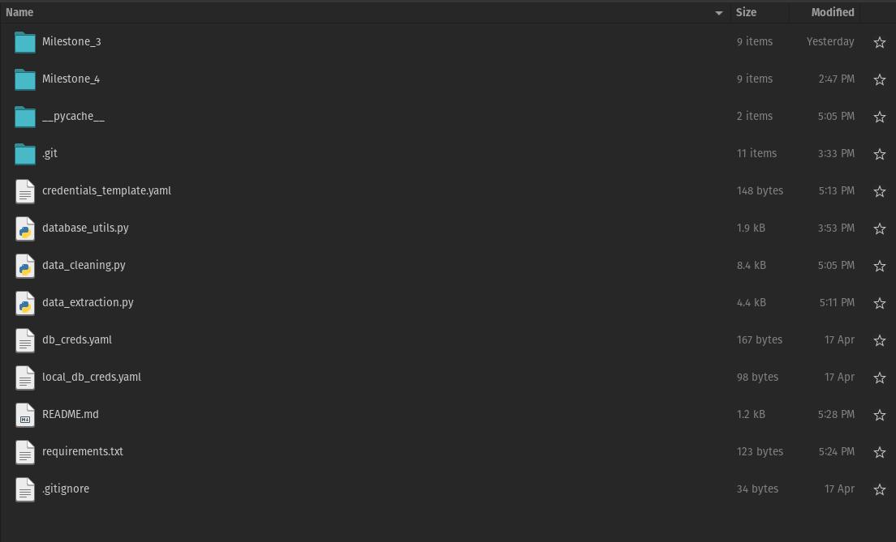

# Multinational Retail Data Centralisation project

This project contains code which extracts pandas dataframes from the following sources:

- An AWS Database
- A pdf file containing a table
- An AWS API
- A `.csv` file stored in an AWS s3 bucket
- A json file

The dataframes are then uploaded to a postgresql database and various sql queries are performed on the database.

## Instructions

### Installation

Run `git clone Bojack-Manhorse/Multinational_Retail_Data_Centralisation_Project` in the terminal, then `cd Multinational_Retail_Data_Centralisation_Project`.

### Setup

Within the same terminal as above, first run `pip install -r requirements.txt`. Then create two files called `db_creds.yaml` and `local_db_creds.yaml` in the project folder. Fill them out as done in `credentials_template.yaml`.
- `db_creds.yaml` will contain the authentication for the database you wish to extract rds tables from.
- `local_db_creds.yaml` will contain the authentication for the database you wish to upload all the tables to.

The file structure should look like this:

### Usage

Run `python3 data_extraction.py` in the terminal.

### Packages used

- `boto3`
- `pandas`
- `requests`
- `tabula`
- `sqlalchemy`
- `yaml`

### License information

???